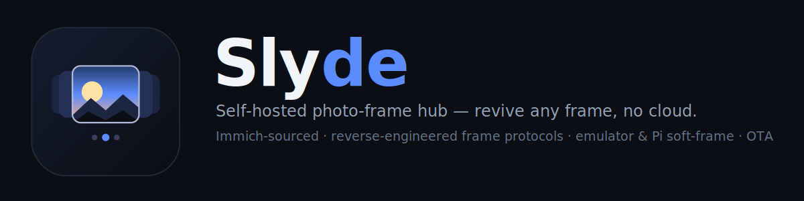

<p align="center">
  
</p>

<p align="center">
  <a href="https://github.com/SlyWombat/slyde/actions/workflows/ci.yml"></a>
  <a href="LICENSE"></a>
  
  
</p>

**Revive a dead smart frame — no cloud, no account, no e-waste.** Slyde brings the discontinued **[Memento Smart Frame](https://www.kickstarter.com/projects/electricobjects/memento-the-4k-smart-frame)** back to life after its cloud service was shut down. It drives the frame entirely over your LAN using a **reverse-engineered local protocol**, sourcing what it shows **one-way and read-only** from your own [Immich](https://immich.app) library, through a modern web UI.

> **First public implementation of the Memento LAN protocol** — reverse-engineered from the discontinued official app and validated live against a firmware-6.02 device. The full wire format is documented in **[`docs/protocol.md`](docs/protocol.md)**. Not affiliated with or endorsed by the original maker.

### Why this exists

When Memento's cloud was switched off, every frame people had paid for became a brick — it could no longer fetch a single photo. Slyde replaces that dead cloud with software **you** run: it speaks the frame's own protocol directly, so the hardware keeps working indefinitely, fed from a photo library you control. No subscription, no third party, nothing leaving your network.

> 🧭 **Where this sits:** most self-hosted "photo frame" projects render a slideshow on a Pi or a browser. Slyde is one of the very few that **revives dedicated commercial frame hardware** over a reverse-engineered protocol — see the [competitive analysis](docs/competitive-analysis.html).

---

## Features

- 🔎 **Zero-config discovery** — finds frames on the LAN (UDP broadcast), or target one by IP.
- 🖼️ **Immich → frame sync** — browse albums, copy photos one-way to the frame ([read-only — your library is never touched](#read-only--one-way--your-library-is-never-touched)). Big albums run as **background jobs with a live progress bar**, so the browser never times out.
- 🔁 **Keep-in-sync subscriptions** — mirror an Immich album to a frame folder 1:1; new photos are pushed and removed ones dropped, on a schedule.
- 🎯 **Smart image fit** — each photo is prepared to the frame's *own reported resolution* and aspect: crop near-matches, blur-fill the sides for portraits (configurable: `contain` / `cover` / `blur` / `smart`).
- 🗂️ **Folder & photo management** — create/delete folders, remove photos, pick the upload destination.
- 🎛️ **Live frame control** — current-image preview, next/previous, slide time, shuffle, night mode, orientation, rename.
- 🧪 **Faithful emulator** — a full software frame for testing with no hardware (the whole test suite runs against it).
- 🖥️ **Soft-frame mode** — run the emulator **fullscreen on a Raspberry Pi** (SDL/KMS, no desktop) as a DIY frame that the Manager treats like the real thing.
- ⬆️ **OTA updates** — publish a release; the Manager shows "update available" and pushes a md5-verified bundle the frame self-applies.
- 📈 **Uptime-Kuma KPI** — a `/health/sync` endpoint for monitoring scheduled syncs.
- 🔒 **Privacy-first** — the frame leaks its Wi-Fi credentials on the LAN; the app **redacts and never stores them**.
- ⚙️ **12-factor, nothing hardcoded** — every deployment value is configuration; runs anywhere.

## How it works

```
 Immich  ──►  Slyde (FastAPI + React)  ──►  Memento frame  (or emulator / Pi soft-frame)
  read-only        sync · image pipeline · OTA            LAN protocol (UDP discovery + TCP control/file)
```

- **`packages/memento-core`** — the reverse-engineered protocol: UDP discovery, TCP control/file channels, the AES/DES crypto, and a sync `FrameClient`.
- **`packages/memento-emulator`** — a faithful server-side emulator; also runs as a fullscreen **soft-frame** (`--mode display`).
- **`packages/slyde-backend`** — FastAPI service: Immich client, image pipeline, sync engine + scheduler, firmware/OTA, and the REST API.
- **`frontend/`** — React + TypeScript + Vite + Tailwind web UI (served by the backend).
- **`deploy/`** — portable `compose.yaml`, the emulator stack, the Pi **soft-frame** install, and example deployments.

Design details: [`docs/architecture.md`](docs/architecture.md) · Protocol: [`docs/protocol.md`](docs/protocol.md) · Usage: [`docs/USAGE.md`](docs/USAGE.md).

### Read-only & one-way — your library is never touched

Slyde only ever **reads** from Immich: it lists albums, reads asset metadata, and downloads image bytes. It issues **no** create, update, or delete calls against your library — this is a designed-in contract, [audited and enforced by a test](packages/slyde-backend/src/slyde_backend/immich.py) (`tests/test_immich.py::test_immich_client_is_read_only`). Photos flow **one direction only — Immich → frame** — and nothing on the frame can propagate back. For defense in depth, give Slyde a **read-scoped Immich API key**; it never needs write access.

## Quick start

### Run the Manager (Docker)
```bash
cp .env.example .env          # set IMMICH_BASE_URL + IMMICH_API_KEY (FRAME_HOST optional)
docker compose up -d          # builds the image (API serves the web UI) and starts it
# open http://localhost:8090
```

### Try it without hardware (emulator)
```bash
uv sync
uv run memento-emulator --name "Test Frame"     # a virtual frame on this host (web UI :8099)
uv run memento discover --host 127.0.0.1        # the CLI finds it
```
Point the Manager at it by adding the emulator's address to `FRAME_HOSTS`.

### Build a DIY frame (Raspberry Pi)
Run the soft-frame fullscreen on a Pi (Pi OS Lite, no desktop) — see [`deploy/softframe/`](deploy/softframe/):
```bash
sudo deploy/softframe/install.sh
```

## Configuration

All via environment variables (12-factor) — copy [`.env.example`](.env.example) and edit. Highlights:

| Key | Purpose |
|-----|---------|
| `IMMICH_BASE_URL` / `IMMICH_API_KEY` | Your Immich instance + API key |
| `FRAME_HOST` / `FRAME_HOSTS` | Explicit frame IP(s); empty enables LAN discovery |
| `FRAME_FIT` | `smart` (default), `contain`, `cover`, or `blur` |
| `SYNC_INTERVAL_MINUTES` | How often kept-in-sync albums re-mirror (`0` = off) |
| `FIRMWARE_REPO` / `MANAGER_BASE_URL` | OTA: release source + frame-reachable manager URL |

The full table is in [`docs/architecture.md`](docs/architecture.md#9-configuration-the-only-place-deployment-values-live).

## Updates (OTA)

> **No competitor surveyed ships a frame-OTA pipeline or an emulator — both are unique here.** ([competitive analysis](docs/competitive-analysis.html))

Push a tag `softframe-vX.Y.Z` (or run the *Release soft-frame bundle* workflow). CI builds `memento-softframe.zip` + `.zip.md5` and attaches them to a GitHub release. Set `FIRMWARE_REPO` on the Manager, click **Check for updates**, then **Update** — the Manager serves the md5-verified bundle and the frame downloads, verifies, and self-applies it. Details: [`deploy/softframe/README.md`](deploy/softframe/README.md).

### See it end-to-end (emulator + OTA, no hardware)

The whole loop runs against the emulator — no frame required:

```bash
# 1. Run a soft-frame from the *published* v0.1.0 bundle (so it reports an old version)
curl -L -o /tmp/sf.zip https://github.com/SlyWombat/slyde/releases/download/softframe-v0.1.0/memento-softframe.zip
mkdir -p /tmp/sf && (cd /tmp/sf && unzip -oq /tmp/sf.zip)
MEMENTO_APP_DIR=/tmp/sf PYTHONPATH=/tmp/sf uv run memento-emulator --name "OTA Demo"   # reports v0.1.0

# 2. Point a Manager at it (FRAME_HOSTS=<emulator-ip>, FIRMWARE_REPO=SlyWombat/slyde,
#    MANAGER_BASE_URL=http://<manager-ip>:8090) and open the web UI.
```

In the UI the frame's firmware row shows **v0.1.1 available** (the latest release > the running v0.1.0). Click **Update**: the Manager fetches the release, **md5-verifies** it, serves it, and the frame **downloads, verifies, swaps its app dir, and restarts** — now reporting v0.1.1. That's the full self-update path, exercised on the emulator.

## Develop

```bash
uv sync                                    # env + workspace
uv run pytest                              # full suite (runs against the emulator — no hardware)
uv run ruff format --check . && uv run ruff check . && uv run mypy
cd frontend && npm ci && npm run build     # web UI
```
CI runs ruff (lint + format), mypy (strict), and pytest on every push.

## License

[MIT](LICENSE) — free to use, modify, and distribute. Not affiliated with the original Memento / Electric Objects. Use at your own risk; interoperability work for hardware you own.
